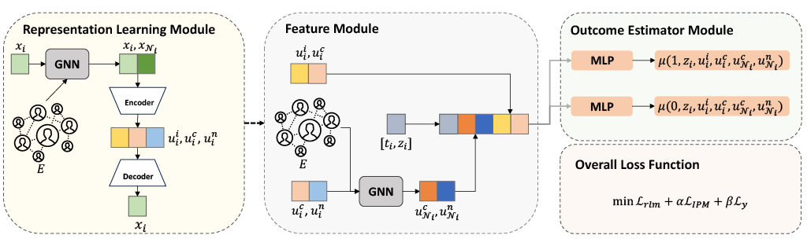

# Causal Effect Estimation under Networked Interference without Networked Unconfoundedness Assumption

Official code for "Causal Effect Estimation under Networked Interference without Networked Unconfoundedness Assumption" (TPAMI 2026)

## CaLaNet

This paper proposes CaLaNet, addressing the challenge of identifying and estimating causal effects under networked interference in the presence of latent confounders.

## Thanks

Our code partly follows the code from [[TNet\]](https://github.com/WeilinChen507/targeted_interference) and [[NetEst\]](https://github.com/songjiang0909/Causal-Inference-on-Networked-Data). Thanks for their code!